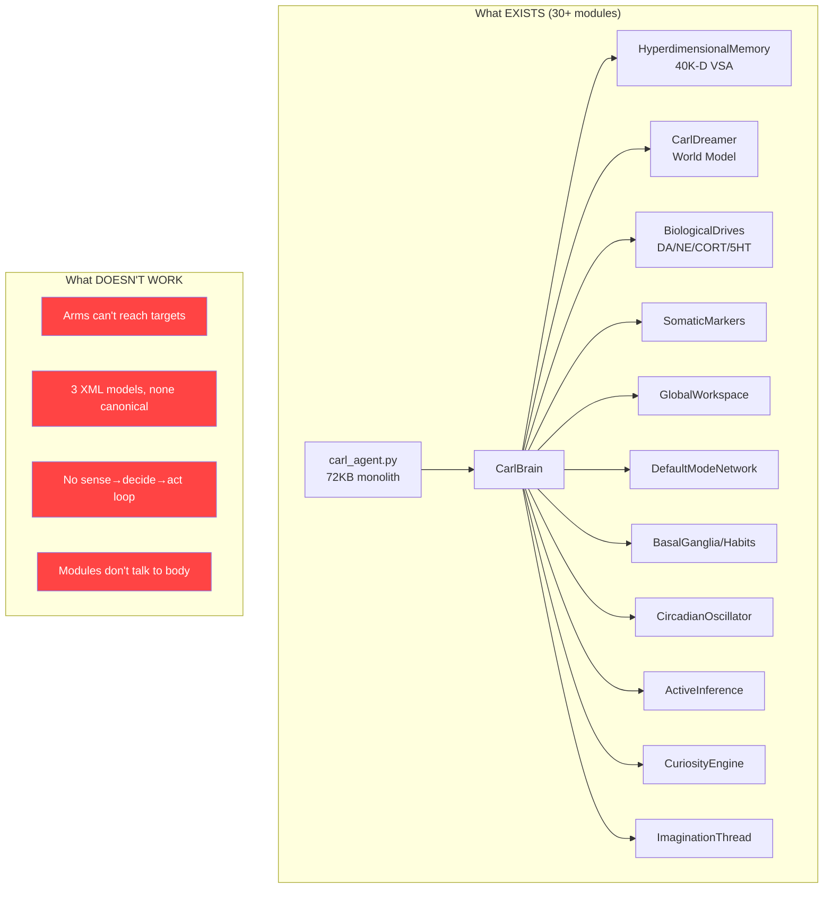
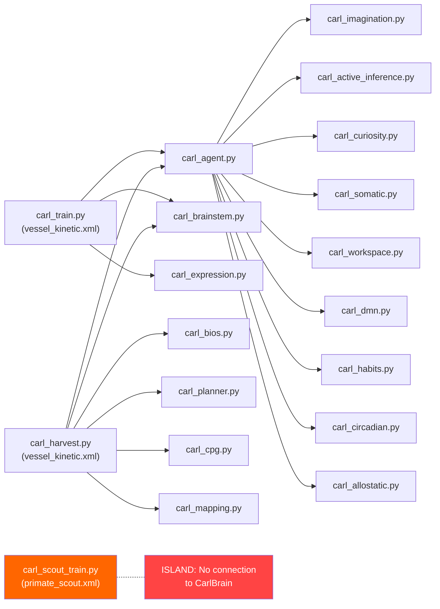

# CARL v5 — Master Roadmap: From Cathedral on Sand to Working Agent

## Current State Diagnosis



### Model Fragmentation Map

| XML Model | Used By | Arm DOF | Wheels | Status |
|---|---|---|---|---|
| `vessel_kinetic.xml` | carl_train.py, carl_harvest.py, carl_arm_bc.py, carl_arm_train.py | 10 (5+5) | 2 | Locomotion works, arms partially |
| `carl_body.xml` | (legacy?) | ? | 2 | Unknown |
| `carl_primate_scout.xml` | carl_scout_train.py | 16 (8+8, with fingers) | 4 | Arms don't converge |

### Import Dependency Map (Current)



> [!CAUTION]
> **The Primate Scout (best body) has ZERO connection to CarlBrain (best mind).** They exist in completely separate codebases. The scout uses its own `ScoutArmPolicy` with ARS, while CarlBrain uses its own `CarlActor` with TD learning. Neither knows the other exists.

---

## The 5-Phase Plan

### Phase 1: Unify the Body (The ONE Model)
**Goal:** Establish `carl_primate_scout.xml` as THE canonical CARL body.

> [!IMPORTANT]
> The Primate Scout has 28 DOF, 4 wheels, 6 spine joints, 2 neck joints, 16 arm joints with fingers, and 6 touch sensors. It's the most complete body. Everything should target this model.

**Tasks:**
1. **Audit `carl_primate_scout.xml`** — verify collision masking, joint limits, actuator gains, touch sensors
2. **Create `carl_body_interface.py`** — a thin abstraction layer that maps named joints/sensors to indices
   - `body.left_arm_ctrl_slice`, `body.right_arm_ctrl_slice`, `body.wheel_ctrl_slice`
   - `body.get_fingertip_pos(side)`, `body.get_touch_readings(side)`
   - `body.get_lidar_readings()`, `body.get_joint_positions(group)`
   - This replaces the scattered hardcoded `slice(12, 28)` constants everywhere
3. **Deprecate `vessel_kinetic.xml` and `carl_body.xml`** — mark as legacy, don't delete yet
4. **Update `carl_train.py`** to load `carl_primate_scout.xml` via the interface

**Deliverable:** Single source of truth for CARL's body. Every script imports from `carl_body_interface.py`.

---

### Phase 2: Make the Arms Work (Option A — BC → PPO)
**Goal:** CARL can reach, grasp, and lift objects with both arms independently.

**Architecture:**
```
┌─────────────────────────────────────────────────┐
│  Phase 2a: IK Demonstration Generator           │
│  ┌───────────┐    ┌──────────────┐              │
│  │ IK Solver │───▶│ 1000 episodes│──▶ demos.npz │
│  │ (DLS)     │    │ L/R/Both     │              │
│  └───────────┘    └──────────────┘              │
│                                                  │
│  Phase 2b: Behavioral Cloning (PyTorch)          │
│  ┌───────────┐    ┌──────────────┐              │
│  │ demos.npz │───▶│ LTC Network  │──▶ bc.pth    │
│  │           │    │ MSE + Adam   │              │
│  └───────────┘    └──────────────┘              │
│                                                  │
│  Phase 2c: PPO Fine-Tuning (PyTorch)             │
│  ┌───────────┐    ┌──────────────┐              │
│  │ bc.pth    │───▶│ PPO (GAE +   │──▶ ppo.pth   │
│  │ (warm)    │    │ clipped obj) │              │
│  └───────────┘    └──────────────┘              │
└─────────────────────────────────────────────────┘
```

**2a — IK Demonstration Generator** (`carl_scout_ik_demo.py`)
- Extend `carl_arm_bc.py`'s IK solver to work with Primate Scout's 5+3 arm structure
- Generate demonstrations for BOTH arms (not just left like current code)
- 3 modes: left-only, right-only, bilateral — matching the curriculum from `carl_scout_train.py`
- Per-episode: spawn cube → IK reaches → close fingers on touch → record (state, action) pairs
- Target: 500+ successful episodes, saved as `memory/scout_demos.npz`

**2b — Behavioral Cloning** (`carl_scout_bc.py`)
- PyTorch LTC network matching `ScoutArmPolicy` architecture (51→48→16)
- Train on (state, action) pairs from demos with MSE loss + Adam
- 200 epochs, batch_size=64, lr=1e-3
- Export trained weights → `memory/scout_bc_weights.npz` (compatible with numpy `ScoutArmPolicy`)
- **Verification:** Run 20 episodes with BC weights, measure average distance. Target: < 0.08m

**2c — PPO Fine-Tuning** (`carl_scout_ppo.py`)
- Start from BC-pretrained weights
- PPO with GAE (λ=0.95, γ=0.99), clipped surrogate (ε=0.2)
- Small value network head on LTC hidden state
- Dense reward: `-distance + 5.0*touch_bonus + 10.0*grasp_contact + 20.0*lift_height`
- Curriculum: reach (100K steps) → grasp (200K steps) → lift (200K steps)
- **Verification:** Successful grasp+lift in >50% of episodes

---

### Phase 3: Build the Integration Backbone
**Goal:** Create a clean sense → decide → act pipeline that connects CarlBrain to the Primate Scout body.

> [!IMPORTANT]
> This is the critical missing piece. CarlBrain currently outputs 2D (throttle, steering). The Primate Scout needs 28D (4 wheels + 6 spine + 2 neck + 16 arms). The backbone must bridge this gap.

**Architecture:**
```
┌──────────────────────────────────────────────────────┐
│                  CarlCortex (new)                     │
│                                                       │
│  ┌────────────┐   ┌─────────────┐   ┌──────────────┐│
│  │ Perception │──▶│  CarlBrain  │──▶│   Action     ││
│  │ Pipeline   │   │ (existing)  │   │  Decoder     ││
│  │            │   │ + arm policy│   │              ││
│  │ • LiDAR    │   │             │   │ • wheels     ││
│  │ • proprio  │   │ Decision:   │   │ • spine      ││
│  │ • touch    │   │ • navigate  │   │ • neck       ││
│  │ • vision   │   │ • reach     │   │ • arms       ││
│  │ • targets  │   │ • grasp     │   │              ││
│  └────────────┘   └─────────────┘   └──────────────┘│
│         ▲                                    │       │
│         └────────────────────────────────────┘       │
│                   SENSORIMOTOR LOOP                   │
└──────────────────────────────────────────────────────┘
```

**Create `carl_cortex.py`** — the integration spine:
```python
class CarlCortex:
    """Unified controller that bridges CarlBrain ↔ MuJoCo body."""
    
    def __init__(self, model, data):
        self.body = BodyInterface(model, data)     # Phase 1
        self.brain = CarlBrain(n_obs=...)          # Existing
        self.arm_policy = ScoutArmPolicy()          # Phase 2 (trained)
        self.brainstem = BrainstemController()       # Existing
        
    def perceive(self, model, data) -> Observation:
        """Build unified observation from all sensors."""
        # LiDAR (8 rays) → obstacle awareness
        # Proprioception → joint states, velocities
        # Touch sensors → fingertip contacts  
        # Target detection → object positions
        # Body state → orientation, speed
        
    def decide(self, obs: Observation) -> Intent:
        """CarlBrain decides high-level intent."""
        # Brain outputs: navigation target, arm goal, emotional state
        # Includes: dreamer prediction, HDC memory, curiosity, habits
        
    def act(self, intent: Intent) -> np.ndarray:
        """Decode intent into 28D control vector."""
        # Wheels: brainstem PID from (v_target, ω_target)
        # Spine: CPG-driven body language
        # Neck: track nearest object of interest
        # Arms: ScoutArmPolicy from trained weights
        
    def step(self, model, data):
        """One full sensorimotor cycle."""
        obs = self.perceive(model, data)
        intent = self.decide(obs)
        ctrl = self.act(intent)
        data.ctrl[:] = ctrl
```

**Key design decisions:**
- CarlBrain's 2D output (throttle, steering) maps to wheel commands via brainstem
- Arm policy runs in parallel, driven by target positions from CarlBrain's planning layer
- Spine/neck run from CPG + attentional gaze direction
- All subsystems (habits, somatic markers, DMN) feed INTO CarlBrain's decision, not directly to motors

---

### Phase 4: Close the Sensorimotor Loop
**Goal:** CARL performs a complete autonomous behavior: see object → navigate to it → reach → grasp → place.

**Create `carl_autonomous.py`** — the main loop:
```python
def main():
    model = mujoco.MjModel.from_xml_path("carl_primate_scout.xml")
    data = mujoco.MjData(model)
    cortex = CarlCortex(model, data)
    cortex.load_weights("memory/")
    
    with mj_viewer.launch_passive(model, data) as viewer:
        while viewer.is_running():
            cortex.step(model, data)
            mujoco.mj_step(model, data)
            viewer.sync()
```

**Behavior sequence to demonstrate:**
1. CARL spawns with 2 colored cubes on the ground
2. Brain detects cubes (via proximity/LiDAR)
3. Curiosity drives approach (navigation via brainstem)
4. Arm policy reaches for nearest cube
5. Fingers close on touch sensor contact
6. Arm lifts cube
7. CARL carries cube to target zone
8. Releases cube
9. Repeats for second cube

**Verification:** Record video showing complete pick-and-place behavior.

---

### Phase 5: Re-integrate Higher Cognition
**Goal:** The 30+ existing modules become functional layers in a working agent.

Once the sensorimotor loop is running, each module slots in naturally:

| Module | Role in Working Agent |
|---|---|
| `carl_brainstem.py` | Reflex override layer (collision avoidance during navigation) |
| `carl_habits.py` | Chunked motor sequences (learned pick-place routines) |
| `carl_curiosity.py` | Drives exploration when no task is active |
| `carl_imagination.py` | Mental rehearsal of pick-place before execution |
| `carl_somatic.py` | "Gut feeling" bias for approach/avoid decisions |
| `carl_workspace.py` | Attention bottleneck — which object to pick next |
| `carl_dmn.py` | Idle-state processing — consolidate memories between tasks |
| `carl_circadian.py` | Activity/rest cycles — training fatigue management |
| `carl_social.py` | React to human presence (via face detection) |
| `carl_expression.py` | Display emotional state via facial servos |
| `carl_evolution.py` | Population-level weight optimization across runs |
| `carl_planner.py` | A* path planning for navigation to objects |
| `carl_mapping.py` | Occupancy grid from LiDAR for spatial awareness |
| `carl_cpg.py` | Rhythmic spine/gait patterns |

> [!NOTE]
> Phase 5 is where all your existing work pays off. The modules aren't wasted — they're just waiting for a body that works.

---

## Execution Priority

```mermaid
gantt
    title CARL v5 Implementation Timeline
    dateFormat  HH:mm
    axisFormat  %H:%M
    
    section Phase 1 - Body
    Body interface module           :p1, 00:00, 45min
    
    section Phase 2 - Arms
    IK demo generator (bilateral)   :p2a, after p1, 60min
    Behavioral cloning training     :p2b, after p2a, 30min
    PPO fine-tuning                 :p2c, after p2b, 90min
    
    section Phase 3 - Backbone
    CarlCortex integration          :p3, after p2b, 60min
    
    section Phase 4 - Loop
    Autonomous behavior demo        :p4, after p3, 45min
    
    section Phase 5 - Cognition
    Module re-integration           :p5, after p4, 120min
```



> [!IMPORTANT]
> **Phases 1 and 2a can start immediately.** Phase 2b runs while we build Phase 3. Phase 2c (PPO) runs in the background while we build Phase 4.

## Open Questions

1. **Should CarlBrain's observation space expand?** Currently 24D (8 LiDAR + proprioception). The Primate Scout has much richer sensing. I'd recommend expanding to ~60D.
2. **Should we keep CarlBrain's 2D action output?** Or expand it to include arm intent (target position)? The cortex layer can handle the translation either way.
3. **Do you want to keep the "Bob" naming** (`vessel_kinetic.xml`) or fully transition to "CARL Primate Scout"?

---

## Phase 6: Cognitive Refactoring & Symbol Grounding (Grounded Mind)
**Goal:** Address Modular Over-Engineering, Monolithic Integration, and Coordinate Frame deficits.

### 1. Semantic Sensor Fusion Layer (`carl_sensor_fusion.py`)
* **Objective:** Shield CarlBrain and Hyperdimensional Memory from raw index-slicing and sensor layout drift.
* **Mechanism:**
  * Implement coordinate frame transformations: Translate global object positions into egocentric space (relative vectors to left hand, right hand, and head camera).
  * Build semantic feature maps (e.g., `obstacle_sectors` from LiDAR, `grip_state` from touch sensors) instead of passing raw float arrays.
  * CarlBrain now operates on **grounded spatial symbols** (meaning head movement doesn't invalidate HDC memory).

### 2. Event-Driven Blackboard message bus (`carl_blackboard.py`)
* **Objective:** Decouple `CarlBrain` from monolithic orchestration and direct-calling 30+ sub-cortical modules.
* **Mechanism:**
  * Define a clean Blackboard system where modules publish and subscribe to events (e.g., `post_event("high_cortisol")`).
  * Cognitive layers (Circadian, Somatic, DMN) become independent, reactive listener processes.
  * Prevents logic sprawl in `carl_agent.py` and allows easy debugging of specific pathways.

---

## Phase 7: Recurrent World Model & Guided Dreamer (Stable Imagination)
**Goal:** Upgrade `CarlDreamer` to prevent divergent hallucinations during sleep cycle training.

### 1. Recurrent World Model (Dreamer v2)
* **Objective:** Replace the simple feedforward MLP with a recurrent model (GRU/LSTM) to model complex physical momentum and interactions.
* **Mechanism:**
  * Capture temporal context so predictions carry forward inertia, gravity, and contact state.
  * Reduce dream trajectory drift from 5 timesteps to 50+ timesteps.

### 2. Kinematic Bounding & Correction
* **Objective:** Constrain dream rollouts using basic physics rules.
* **Mechanism:**
  * Implement boundary checking in the dreaming thread: if a dream rollout predicts the agent passing through solid geom or flying, clamp the state to the nearest valid kinematic bounding box.

